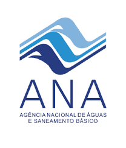

---
output:
  html_document:
    theme: null
    css: assets/css/theme.css
    includes:
      in_header: assets/includes/head.html
      before_body: assets/includes/navbar.html
---


```{r setup, include=FALSE}
library(dplyr)
library(leaflet)
library(leaflet.extras)
library(sf)
library(lubridate)
library(tidyr)
library(dygraphs)

source("scripts/load_preprocessed.R")
```


```{=html}
<section class="hero">
  <div class="hero-content">
    <h1>Demanda Bioquímica de Oxigênio</h1>
    <div class="section-head">
      <h2>Indicador da carga de matéria orgânica e da pressão sobre o oxigênio da água</h2>
    </div>
  </div>
</section>

```

```{=html}
<section class="section">
  <div class="panel panel--wide">
    <p>A Demanda Bioquímica de Oxigênio (DBO) indica a quantidade de oxigênio consumida nos processos biológicos de degradação da matéria orgânica no meio aquático. A DBO de uma amostra de água é geralmente medida em laboratório, por meio de um bioensaio realizado em condições controladas. A DBO é um bom indicador da poluição da água por cargas orgânicas, como os esgotos domésticos.</p>

    <p>A <a href="https://conama.mma.gov.br/?id=450&amp;option=com_sisconama&amp;task=arquivo.download" target="_blank">Resolução CONAMA nº 357/2005</a> define os níveis máximo de DBO para rios e lagos para as classes de qualidade:</p>

    <ul class="panel-list">
      <li>Classe 1: máximo de 3 mg/L</li>
      <li>Classe 2: máximo de 5 mg/L</li>
      <li>Classe 3: máximo de 6 mg/L</li>
      <li>Classe 4: máximo de 10 mg/L</li>
    </ul>

    <p>O mapa interativo mostra a frequência de Não-Conformidade (NC%) com as metas dos trechos monitorados. Ao desativar a camada NC% no mapa, são apresentados os valores médios (mg/L) de fósforo total. Para trechos sem enquadramento, valem os limites da Classe 2. Médias elevadas de fósforo podem ser observadas principalmente nas grandes cidades e nos açudes do Nordeste brasileiro. Valores médios de DBO mais altos indicam pior qualidade da água. Quanto maior a NC%, maior a necessidade de ações e investimentos para alcançar os padrões de qualidade necessários. Para trechos não enquadrados, o limite da Classe 2 é usado como referência.</p>
    <h3>Valores médios (mg/L) e Não-Conformidade (NC%) de DBO entre 2010-2024</h3>
```

```{r mapa_dbo, echo=FALSE, message=FALSE, warning=FALSE}
old_opts <- options(OutDec = ",", digits = 2)
on.exit(options(old_opts), add = TRUE)

dbo_filtrado <- grouped_obs_dbo %>%
  filter(n >= 10)

coords <- sf::st_coordinates(dbo_filtrado)
dbo_map <- dbo_filtrado %>%
  mutate(
    lng = coords[, 1],
    lat = coords[, 2]
  ) %>%
  sf::st_drop_geometry()

bins_media <- c(0, 3, 5, 6, 10, 250)
bins_nc <- seq(0, 100, 20)

pal_media <- leaflet::colorBin(
  palette = c('light sky blue', 'lime green', 'yellow','orange', 'red', 'dark magenta'),
  bins = bins_media,
  domain = dbo_map$`Média`,
  na.color = "#d1d5db"
)

pal_nc <- leaflet::colorBin(
  palette = c("#fee5d9", "#fcae91", "#fb6a4a", "#de2d26", "#a50f15"),
  bins = bins_nc,
  domain = dbo_map$NC,
  na.color = "#d1d5db"
)

popup_media <- leafpop::popupTable(
  dbo_map,
  zcol = c("Código", "n", "De", "Até", "Média"),
  row.numbers = FALSE,
  feature.id = FALSE
)

popup_nc <- leafpop::popupTable(
  dbo_map,
  zcol = c("Código", "n", "De", "Até", "NC", "Classe"),
  row.numbers = FALSE,
  feature.id = FALSE
)

mapa_final_dbo <- leaflet(dbo_map) %>%
  leaflet::setView(
    lng = -51.0,
    lat = -15,
    zoom = 4
  ) %>%
  # Adicionar Provider Tiles (Mapas Base)
  leaflet::addProviderTiles(providers$OpenStreetMap, group = "Padrão") %>%
  leaflet::addProviderTiles(providers$Esri.WorldImagery, group = "Satélite") %>% 
  leaflet::addCircleMarkers(
    lng = ~lng,
    lat = ~lat,
    radius = 3,
    stroke = FALSE,
    fillOpacity = 0.9,
    color = ~pal_media(`Média`),
    fillColor = ~pal_media(`Média`),
    popup = popup_media,
    group = "Média (mg/L)"
  ) %>%
  leaflet::addCircleMarkers(
    lng = ~lng,
    lat = ~lat,
    radius = 3,
    stroke = FALSE,
    fillOpacity = 0.9,
    color = ~pal_nc(NC),
    fillColor = ~pal_nc(NC),
    popup = popup_nc,
    group = "NC%"
  ) %>%
  leaflet::addLegend(
    position = "topright",
    pal = pal_media,
    values = dbo_map$`Média`,
    title = "Média (mg/L)",
    opacity = 0.9,
    className = "legend-media"
  ) %>%
  leaflet::addLegend(
    position = "topright",
    pal = pal_nc,
    values = dbo_map$NC,
    title = "NC%",
    opacity = 0.9,
    className = "legend-nc"
  ) %>%
  # Reconfigurar o Controle de Camadas (adicionando os grupos base)
  leaflet::addLayersControl(
    baseGroups = c("Padrão", "Satélite"),
    overlayGroups = c("Média (mg/L)", "NC%"),
    options = layersControlOptions(collapsed = TRUE, position = "topright")
  ) %>%
  leaflet::hideGroup("NC%") %>%
  # Adicionar a funcionalidade de busca (SearchOSM)
  leaflet.extras::addSearchOSM(
    options = leaflet.extras::searchOptions(
      collapsed = TRUE, autoCollapse = TRUE, zoom = 10, position = "topleft",
      textPlaceholder = "Buscar locais...", textErr = "Local não encontrado",
      marker = list(icon = NULL, animate = TRUE, circle = list(radius = 10, weight = 3, color = "#c51b7d", stroke = TRUE, fill = FALSE))
    ) 
    ) %>%

  leaflet.extras::addResetMapButton()

# 5. Exibir o mapa no RMarkdown (chame o objeto)
mapa_final_dbo
```

```{=html}
    <p>Os gráficos abaixo mostram a evolução da DBO em corpos hídricos localizados nos ambientes lênticos/lóticos e rurais/urbanos entre 2010 e 2024. A NC% da DBO nos lagos aumentou ao longo do período. Apesar de uma aparente redução da DBO, corpos de água situados nas áreas urbanizadas apresentam médias de DBO mais altas em relação ao ambiente rural, o que aponta para a necessidade de expansão do tratamento dos efluentes produzidos nas cidades.</p>
```

```{=html}
    <div class="chart-block">
      <h3>Não-Conformidade (NC%) de DBO: ambientes lênticos e lóticos</h3>
```

```{r grafico_nc_dbo, echo=FALSE, message=FALSE, warning=FALSE}
dbo_desc_regime <- tbl_dbo %>%
  filter(regime %in% c("lentico", "lotico")) %>%
  group_by(ano = year(data), regime) %>%
  summarise(
    nao_nulos = sum(!is.na(desc)),
    NC = sum(desc == 1, na.rm = TRUE),
    .groups = "drop"
  )

ano_final_dbo <- max(2024, max(year(tbl_dbo$data), na.rm = TRUE))
anos_dbo <- seq(
  min(year(tbl_dbo$data), na.rm = TRUE),
  ano_final_dbo
)

dbo_desc_regime <- dbo_desc_regime %>%
  tidyr::complete(
    ano = anos_dbo,
    regime = c("lentico", "lotico"),
    fill = list(nao_nulos = 0, NC = 0)
  ) %>%
  mutate(freq_nc = if_else(nao_nulos == 0, NA_real_, (NC / nao_nulos) * 100))

df_regime_year_dbo <- dbo_desc_regime %>%
  pivot_wider(
    names_from = regime,
    values_from = freq_nc
  )

freq_regime_dbo <- df_regime_year_dbo %>%
  select(ano, lentico, lotico)

dygraph(freq_regime_dbo) %>%
  dySeries("lentico", label = "NC(%) lêntico", color = "#003a5d") %>%
  dySeries("lotico", label = "NC(%) lótico", color = "#38bdf8") %>%
  dyOptions(
    drawPoints = TRUE,
    pointSize = 5,
    strokeWidth = 3,
    connectSeparatedPoints = TRUE
  ) %>%
  dyAxis("x", valueRange = c(min(anos_dbo), max(anos_dbo)))
```

```{=html}
    </div>
    <div class="chart-block">
      <h3>Médias de DBO: meios rural e urbano</h3>
```

```{r grafico_media_dbo, echo=FALSE, message=FALSE, warning=FALSE}
tbl_urbano_dbo <- tbl_dbo %>%
  filter(tipo %in% c("Área urbanizada", "rural"))

grouped_obs_year_dbo <- tbl_urbano_dbo %>%
  group_by(ano = year(data), tipo) %>%
  summarise(
    n = n(),
    Media = mean(valor),
    .groups = "drop"
  )

grouped_obs_year_dbo <- grouped_obs_year_dbo %>%
  tidyr::complete(
    ano = anos_dbo,
    tipo = c("Área urbanizada", "rural")
  )

df_urbano_year_dbo <- grouped_obs_year_dbo %>%
  pivot_wider(
    names_from = tipo,
    values_from = Media
  )

media_urbano_dbo <- df_urbano_year_dbo %>%
  rename(
    Rural = `rural`,
    Urbano = `Área urbanizada`
  ) %>%
  select(ano, Rural, Urbano)

dygraph(media_urbano_dbo) %>%
  dySeries("Rural", label = "Rural", color = "#003a5d") %>%
  dySeries("Urbano", label = "Urbano", color = "#38bdf8") %>%
  dyOptions(
    drawPoints = TRUE,
    pointSize = 5,
    strokeWidth = 3,
    connectSeparatedPoints = TRUE
  ) %>%
  dyAxis("x", valueRange = c(min(anos_dbo), max(anos_dbo)))
```

```{=html}
    </div>
```

```{=html}
  </div>
</section>
```

```{=html}
<section class="section section--cta">
  <div class="cta-box">
    <div>
      <h2>Explore os indicadores</h2>
      <p>Visualize mapas e gráficos interativos por tema.</p>
    </div>
    <div class="cta-actions">
      <a class="cta" href="iqa.html">Acessar IQA →</a>
      <a class="cta cta--ghost" href="oxigenio.html">Acessar OD →</a>
    </div>
  </div>
</section>
```

```{=html}
<footer class="footer">
  <div class="footer-container">

    <div class="footer-top">
      <div class="footer-brand">
        
        <div>
          <div class="footer-org">Agência Nacional de Águas e Saneamento Básico (ANA)</div>
          <div class="footer-gov">Governo Federal – Brasil</div>
        </div>
      </div>

      <div class="footer-links">
        <a href="index.html">Início</a>
        <a href="iqa.html">IQA</a>
        <a href="oxigenio.html">OD</a>
      </div>
    </div>

    <div class="footer-grid">
      <div class="footer-col">
        <h4>Sobre o portal</h4>
        <p>O portal Qualidade da Água no Brasil apresenta dados oficiais de monitoramento da qualidade das águas superficiais, organizados de forma clara, transparente e acessível.</p>
      </div>

      <div class="footer-col">
        <h4>Contato</h4>
        <a href="mailto:cqual@ana.gov.br" class="footer-mail">
          <p>Coordenação de Qualidade de Água e Enquadramento</p>
        </a>
      </div>
    </div>

    <div class="footer-bottom">
      <p>© <span id="ano-atual"></span> Agência Nacional de Águas e Saneamento Básico (ANA). Dados públicos para apoio à gestão dos recursos hídricos.</p>
    </div>

  </div>
</footer>

<script>
  document.getElementById("ano-atual").textContent = new Date().getFullYear();
</script>
```
