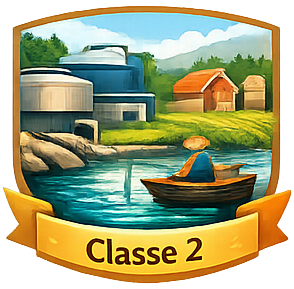
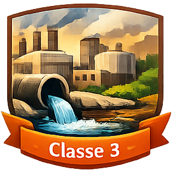

---
output:
  html_document:
    theme: null
    css: assets/css/theme.css
    includes:
      in_header: assets/includes/head.html
      before_body: assets/includes/navbar.html
---

```{r setup, include=FALSE}
library(dplyr)
library(sf)
library(tmap)
library(leaflet)
library(leaflet.extras)
library(dygraphs)
library(readxl)

source("scripts/load_enquadramento.R")
```

```{=html}
<section class="hero">
  <div class="hero-content">
    <h1>Enquadramento</h1>
    <div class="section-head">
      <h2>Metas de qualidade para rios e lagos conforme usos da água</h2>
    </div>
  </div>
</section>
```

```{=html}
<section class="section">
  <div class="panel panel--wide">
  

    <h3>Enquadramento e planejamento</h3>  

    <p>
O enquadramento é o instrumento de planejamento previsto na <a href="https://www.planalto.gov.br/ccivil_03/leis/l9433.htm" target="_blank">Política Nacional de Recursos Hídricos</a> que visa assegurar água com qualidade adequada para os diversos usos. Por meio de um processo participativo, os Comitês de Bacia, os usuários de água e a sociedade civil definem metas de qualidade para as águas da bacia hidrográfica a serem alcançados por meio de ações planejadas.
   </p>
    <p>
A <a href="https://www.gov.br/ana/pt-br" target="_blank">Agência Nacional de Águas e Saneamento Básico (ANA)</a> e os órgãos gestores de recursos hídricos das Unidades da Federação atuam coordenando e fornecendo suporte técnico aos comitês de bacia para estabelecer e monitorar as metas de qualidade de água necessárias para garantir os diversos usos previstos no enquadramento. 
   </p>
    <p>
Esse instrumento orienta o <strong>controle da poluição, o monitoramento e o planejamento de ações de gestão dos recursos hídricos</strong>. <strong><a href="https://www.snirh.gov.br/portal/snirh/centrais-de-conteudos/conjuntura-dos-recursos-hidricos/encarte_enquadramento_conjuntura2019.pdf" target="_blank">Saiba mais sobre o Enquadramento clicando aqui</a></strong>.
    </p>

  <h3>Classes de qualidade</h3>
  <p><strong>A <a href="https://conama.mma.gov.br/?id=450&amp;option=com_sisconama&amp;task=arquivo.download" target="_blank">Resolução CONAMA nº 357/2005</a> classifica rios, lagos e reservatórios em classes de qualidade</strong>, definindo metas a serem alcançadas ou mantidas conforme os usos preponderantes da água. Essas classes variam de acordo com os usos da água.
  </p>
  
  <div class="grid-2">
  
    <div class="eq-card eq-especial">
    <div class="eq-card__header">
      
      <h3 class="eq-title">Classe Especial</h3>
 
    </div>

    <p class="eq-text">     

        Águas com mínima interferência humana, indicadas para <strong>abastecimento humano com desinfecção simples</strong>
        e para a <strong>preservação integral dos ecossistemas aquáticos</strong>. Classe mandatória em Unidades de Conservação de Proteção Integral.
    </p>
  </div>
  
  
  
    <div class="eq-card eq-c1">
    <div class="eq-card__header">
      
      <h3 class="eq-title">Classe 1</h3>

    </div>

    <p class="eq-text">
       Águas com pouco poluídas, compatíveis com <strong>abastecimento humano após tratamento simplificado</strong>, <strong>irrigação de hortaliças que são consumidas cruas e proteção da vida aquática.</strong>.Classe mandatória em Terras Indígenas.
    </p>
  </div>


  
    <div class="eq-card eq-c2">
    <div class="eq-card__header">
      
      <h3 class="eq-title">Classe 2</h3>

    </div>

    <p class="eq-text">
Águas compatíveis com múltiplos usos, incluindo <strong>abastecimento humano após tratamento convencional</strong>,<strong>irrigação</strong>, <strong>aquicultura</strong> e <strong>recreação</strong>.</strong> Classe adotada quando não há enquadramento estabelecido, conforme artigo 42 da Resolução CONAMA nº 357/2005.
    </p>
  </div>


    <div class="eq-card eq-c3">
    <div class="eq-card__header">
      
      <h3 class="eq-title">Classe 3</h3>

    </div>

    <p class="eq-text">
 Águas com maior presença de poluentes, indicadas para <strong>abastecimento humano após tratamento avançado</strong>,
        <strong>irrigação de culturas específicas</strong> e alguns <strong>usos industriais</strong>. Exige tratamento mais rigoroso para usos mais sensíveis.
    </p>
  </div>


    <div class="eq-card eq-c4">
    <div class="eq-card__header">
      
      <h3 class="eq-title">Classe 4</h3>

    </div>

    <p class="eq-text">
Classe com a pior qualidade. Águas destinadas principalmente à <strong>navegação</strong> e à <strong>harmonia paisagística</strong>, não sendo indicadas para abastecimento humano nem para a maioria dos usos recreativos.
    </p>
    </div>

  </div>

  <h3>Classes de qualidade da água e seus indicadores</h3>
  
    <p>As <strong>classes de qualidade da água</strong> definem os <strong>níveis de condição ambiental</strong> que um corpo d’água deve apresentar para atender a determinados <strong>usos preponderantes</strong>, considerando sempre o uso mais restritivo a ser protegido, como o abastecimento humano ou a preservação da vida aquática. Cada classe estabelece <strong>padrões e limites</strong> para os <strong>indicadores de qualidade da água</strong> — físicos, químicos e biológicos — que expressam, de forma mensurável, se a água está compatível com esses usos. Dessa forma, os indicadores funcionam como a <strong>base técnica de verificação</strong> do enquadramento, permitindo avaliar, monitorar e orientar ações de gestão para manter ou melhorar a qualidade da água conforme os objetivos definidos.</p>
  
   <h3>Relação entre parâmetros indicadores e classes de qualidade</h3>
  
```


| Parâmetro | O que indica | Classes mais exigentes | Classes menos exigentes |
|---------|-------------|----------------------|------------------------|
| Oxigênio Dissolvido (OD) | Condições para a vida aquática | Valores mínimos mais altos (Classe Especial e 1) | Valores mínimos menores (Classes 3 e 4) |
| Demanda Bioquímica de Oxigênio (DBO) | Carga de matéria orgânica | Valores máximos mais baixos | Valores máximos mais elevados |
| Fósforo Total | Risco de eutrofização | Limites mais restritivos | Limites mais flexíveis |
| Índice de Qualidade da Água (IQA)* | Síntese da qualidade da água | Valores mais altos indicam melhor qualidade | Valores mais baixos indicam pior qualidade |

\* O IQA não define classes legais, mas é amplamente utilizado como indicador sintético para apoiar a avaliação do enquadramento.


```{=html}

    <h3>Evolução do enquadramento no Brasil</h3>
  <p>
  O enquadramento é um instrumento que vem sofrendo aperfeiçoamentos visando sua implementação em todo o país. O gráfico mostra a evolução da implementação do enquadramento com base no número de propostas aprovadas ao longo do tempo e os principais marcos legais que definem este instrumento.
  </p>


    

```

```{=html}
    <div class="chart-block">
      <h3>Implementação e marcos legais do enquadramento</h3>
```

```{r grafico_evol_eca, echo=FALSE, message=FALSE, warning=FALSE, out.width='100%'}
evolucao_eca <- read_excel("evolucao_eca.xlsx")
evo_eca <- evolucao_eca %>% select(1, 2)

dygraph(evo_eca) %>%
  dyAxis("y", label = "Número de normativos aprovados", valueRange = c(0, 130)) %>%
  dyOptions(axisLineWidth = 1.5, fillGraph = TRUE, drawGrid = FALSE) %>%
#  dyRangeSelector(height = 5) %>%
  dyEvent("1977", "Port. nº 13 do Ministério do Interior", labelLoc = "bottom") %>%
  dyEvent("1986", "Res. Conama nº 20", labelLoc = "bottom") %>%
  dyEvent("1997", "Lei federal nº 9.433", labelLoc = "bottom") %>%
  dyEvent("2005", "Res. CONAMA nº 357", labelLoc = "bottom") %>%
  dyEvent("2008", "Res. CNRH nº 91", labelLoc = "bottom")
```

```{=html}
    </div>
      
```

```{=html}

<div class="grid-2">
  <div class="eq-card">
  
    <ul class="panel-list">
    
      <li><a href="https://bvsms.saude.gov.br/bvs/saudelegis/cnnpa/1977/res0013_15_07_1977.html"><strong>Portaria nº 13 do Ministério do Interior/1977</strong></a> – instituiu a primeira classificação oficial das águas interiores no Brasil, definindo classes de qualidade vinculadas aos usos da água, <strong>sendo o marco inicial para o enquadramento e o controle da poluição hídrica no país</strong>.</li>   
    
      <li><a href="https://www.ibama.gov.br/sophia/cnia/legislacao/MMA/RE0020-180686.PDF" target="_blank"><strong>Resolução CONAMA nº 20/1986</strong></a> – estabelece a classificação das águas superficiais no Brasil e define padrões de qualidade conforme os usos previstos, <strong>servindo de base normativa para o controle da poluição e o enquadramento dos corpos d’água</strong>.</li>
    
      <li><a href="https://www.planalto.gov.br/ccivil_03/leis/l9433.htm" target="_blank">
      <strong>Lei nº 9.433/1997</strong></a> – institui a Política Nacional de Recursos Hídricos e define o <strong>enquadramento</strong> como instrumento para assegurar qualidade compatível com os usos e orientar o controle da poluição.</li>
      
      <li><a href="https://conama.mma.gov.br/?id=450&amp;option=com_sisconama&amp;task=arquivo.download" target="_blank"><strong>Resolução CONAMA nº 357/2005</strong></a> – estabelece as <strong>classes de qualidade das águas superficiais</strong>, os usos associados e padrões de referência para avaliação e gestão.</li>

      <li><a href="https://conama.mma.gov.br/?option=com_sisconama&task=arquivo.download&id=545" target="_blank"><strong>Resolução CONAMA nº 396/2008</strong></a> – complementa o arcabouço normativo ao tratar da <strong>classificação das águas subterrâneas</strong>, promovendo coerência na gestão da qualidade.</li>

      <li><a href="https://www.ceivap.org.br/ligislacao/Resolucoes-CNRH/Resolucao-CNRH%2091.pdf"><strong>Resolução CNRH nº 91/2008</strong></a> – estabelece <strong>procedimentos gerais para o enquadramento</strong> de corpos de água superficiais e subterrâneos no Brasil.</li>
      </ul>
  </div>
 </div>


 <h3>Bacias com enquadramento</h3>
```


```{r mapa_enquadramento, echo=FALSE, message=FALSE, warning=FALSE, out.width='100%'}
tmap_mode("view")

mapa_eca_tmap <- 
  tm_shape(enq_estadual_final, name = "Enquadramento Estadual") + 
  tm_polygons(
    fill = "#329671",
    alpha = 0.5,
    border.col = "white",
    lwd = 0.5,
    popup.vars = c(
      "UF:" = "uf", 
      "Conselho RH:" = "conselho_rh", 
      "Nome:" = "nome", 
      "Normativo:" = "normativo"
    ),
    legend.show = FALSE
  ) +
  tm_shape(enq_uniao_final, name = "Enquadramento União") + 
  tm_polygons(
    fill = "#27BBF5",
    alpha = 0.5,
    border.col = "white",
    lwd = 0.5,
    popup.vars = c(
      "UF:" = "uf", 
      "Conselho RH:" = "conselho_rh", 
      "Nome:" = "nome", 
      "Normativo:" = "normativo"
    ),
    legend.show = FALSE
  ) +
  tm_layout(frame = FALSE)

mapa_final_eca_tmap <- tmap_leaflet(mapa_eca_tmap) %>%
  leaflet::setView(lng = -51.0, lat = -15, zoom = 4) %>%
  leaflet::addProviderTiles(providers$OpenStreetMap, group = "OpenStreetMap (Padrão)") %>%
  leaflet::addProviderTiles(providers$Esri.WorldImagery, group = "Satélite (Esri)") %>%
  leaflet::addProviderTiles(providers$CartoDB.Positron, group = "Tema Claro (CartoPositron)") %>%
  leaflet::addLayersControl(
    baseGroups = c("OpenStreetMap (Padrão)", "Satélite (Esri)", "Tema Claro (CartoPositron)"),
    overlayGroups = c("Enquadramento Estadual", "Enquadramento União"),
    options = layersControlOptions(collapsed = TRUE, position = "topright")
  ) %>%
  leaflet::addLegend(
    position = "bottomright",
    colors = c("#329671", "#27BBF5"),
    labels = c("Estado", "União"),
    title = "Domínio",
    opacity = 1,
    className = "legend-media"
  ) %>%
  leaflet.extras::addSearchOSM(
    options = leaflet.extras::searchOptions(
      collapsed = TRUE,
      autoCollapse = TRUE,
      zoom = 10,
      position = "topleft",
      textPlaceholder = "Buscar locais...",
      textErr = "Local não encontrado",
      marker = list(icon = NULL, animate = TRUE, circle = list(radius = 10, weight = 3, color = "#c51b7d", stroke = TRUE, fill = FALSE))
    )
  ) %>%
  leaflet.extras::addResetMapButton()

mapa_final_eca_tmap
```

```{=html}
</section>
<section class="section section--cta">
  <div class="cta-box">
    <div>
      <h2>Explore os indicadores</h2>
      <p>Visualize mapas e gráficos interativos por tema.</p>
    </div>
    <div class="cta-actions">
      <a class="cta" href="iqa.html">IQA</a>
      <a class="cta" href="od.html">OD</a>
      <a class="cta" href="dbo.html">DBO</a>
      <a class="cta" href="fosforo.html">Fósforo</a>
    </div>
  </div>
</section>
```
    

```{=html}
<footer class="footer">
  <div class="footer-container">

    <div class="footer-top">
      <div class="footer-brand">
        
        <div>
          <strong>Agência Nacional de Águas e Saneamento Básico</strong>
          <div class="footer-gov">Governo Federal – Brasil</div>
        </div>
      </div>
    </div>

    <div class="footer-grid">
      <div class="footer-col">
        <h4>Sobre o portal</h4>
        <p>
          Este portal apresenta informações oficiais sobre a qualidade das águas
          superficiais no Brasil, com base em dados públicos e metodologias
          padronizadas.
        </p>
      </div>

      <div class="footer-col">
        <h4>Conteúdo</h4>
        <ul>
          <li><a href="iqa.html">Índice de Qualidade da Água</a></li>
          <li><a href="od.html">Oxigênio Dissolvido</a></li>
          <li><a href="dbo.html">DBO</a></li>
          <li><a href="fosforo.html">Fósforo Total</a></li>
          <li><a href="enquadramento.html">Enquadramento</a></li>          
        </ul>
      </div>

      <div class="footer-col">
        <h4>Contato</h4>
        <ul>
          <li>
            <a href="mailto:cqual@ana.gov.br">
              cqual@ana.gov.br
            </a>
          </li>
          <li>Atendimento institucional</li>
        </ul>
      </div>
    </div>

    <div class="footer-bottom">
      <p>
        © Agência Nacional de Águas e Saneamento Básico (ANA).
        Dados públicos para apoio à gestão dos recursos hídricos.
      </p>
    </div>

  </div>
</footer>


```
