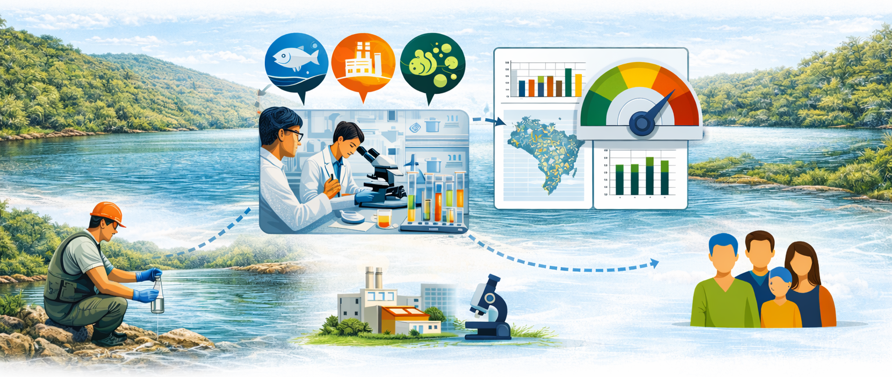

---
output:
  html_document:
    theme: null
    css: assets/css/theme.css
    includes:
      in_header: assets/includes/head.html
      before_body: assets/includes/navbar.html
---

```{=html}
<section class="hero">
  <div class="hero-content">
    <h1>Qualidade da Água no Brasil</h1>
  <div class="section-head">
    <h2>Transparência, informação pública e apoio à gestão dos recursos hídricos</h2>
  </div>
  
  </div>
</section>

```

```{=html}
<section class="section">
  <div class="panel panel--wide">
    <p>O Qualidade da Água no Brasil é um portal público dedicado a apresentar, de forma clara, padronizada e acessível, os dados oficiais de qualidade das águas superficiais do país. A plataforma reúne informações produzidas pelas Unidades da Federação, no âmbito da <a href="https://www.gov.br/ana/pt-br/assuntos/monitoramento-e-eventos-criticos/qualidade-da-agua" target="_blank">Rede Nacional de Monitoramento da Qualidade da Água (RNQA)</a>, coordenada pela <a href="https://www.gov.br/ana/pt-br" target="_blank">Agência Nacional de Águas e Saneamento Básico (ANA)</a>.</p>
    
      <p>Nosso compromisso é transformar dados técnicos em informação útil para a sociedade, fortalecendo a transparência, a participação social e a tomada de decisão baseada em evidências.</p>
  </div>

  <div class="panel panel--wide">
    <h3>Como a qualidade da água é avaliada</h3>

    <p>
      A qualidade da água de rios, lagos e reservatórios não é observada apenas
      pela aparência. Ela é avaliada por meio de indicadores físico-químicos e
      biológicos, obtidos a partir do monitoramento sistemático realizado em
      estações distribuídas pelo território nacional.
    </p>

    <figure class="panel-figure">
      
      <figcaption>
        Fluxo de coleta, análise e transformação de dados em informação sobre a qualidade da água.
      </figcaption>
    </figure>

    <p>
      Nas estações da Rede Nacional de Monitoramento da Qualidade da Água (RNQA),
      técnicos coletam amostras de água em pontos fixos e em períodos regulares.
      Essas amostras são analisadas em laboratório ou por sensores em campo,
      seguindo procedimentos padronizados, o que permite comparar resultados ao
      longo do tempo e entre diferentes regiões do país.
    </p>

    <p>
      Cada indicador fornece uma informação específica sobre as condições do
      corpo hídrico:
    </p>

    <ul class="panel-list">
      <li>
        <strong>Oxigênio Dissolvido (OD)</strong> indica se a água possui oxigênio
        suficiente para sustentar a vida aquática. Reduções no OD podem indicar
        poluição ou excesso de matéria orgânica.
      </li>

      <li>
        <strong>Demanda Bioquímica de Oxigênio (DBO)</strong> representa a
        quantidade de matéria orgânica presente na água e o consumo de oxigênio
        durante sua decomposição.
      </li>

      <li>
        <strong>Fósforo Total</strong> aponta a presença de nutrientes que, em
        excesso, podem causar crescimento excessivo de algas e degradação da
        qualidade da água.
      </li>
    </ul>

    <p>
      Esses parâmetros, analisados em conjunto, permitem identificar alterações
      causadas por esgotos, atividades agrícolas, industriais ou urbanas, bem
      como acompanhar processos de recuperação ambiental.
    </p>

    <p>
      Para facilitar a compreensão dos resultados, vários desses parâmetros são
      integrados no <strong>Índice de Qualidade da Água (IQA)</strong>, que resume
      diferentes medições em uma escala única, geralmente classificada como
      ótima, boa, regular, ruim ou péssima.
    </p>

    <p>
      O acompanhamento contínuo desses indicadores ao longo do tempo é essencial
      para:
    </p>

    <ul class="panel-list">
      <li>Avaliar tendências de melhoria ou degradação da qualidade da água;</li>
      <li>Apoiar ações de gestão, fiscalização e saneamento;</li>
      <li>Avaliar efeitos das políticas públicas, como o enquadramento dos corpos hídricos;</li>
      <li>Informar a sociedade sobre a situação dos recursos hídricos.</li>
    </ul>

  </div>

```

```{=html}    
<div class="panel panel--wide">
      <h3>Origem e confiabilidade dos dados</h3>
      
      <p>Todos os dados apresentados neste portal são provenientes da Rede Nacional de Monitoramento da Qualidade da Água (RNQA), formada por estações de monitoramento operadas por órgãos estaduais e distritais de recursos hídricos e meio ambiente. As informações seguem metodologias padronizadas e critérios técnicos nacionais, promovidos pela ANA, o que garante a comparabilidade dos dados em escala nacional. Este portal atua exclusivamente como uma plataforma de organização, visualização e divulgação, não alterando nem reinterpretando tecnicamente os dados originais.</p>
     
     <h3>Monitoramento nas unidades da federação</h3> 
      
```


```{r mapa_parceiros, echo=FALSE, message=FALSE, warning=FALSE}
library(dplyr)
library(leaflet)
library(geobr)

# parceiros <- data.frame(
#   uf = c("SP","MG","RJ","BA"),
#   parceiro = c("CETESB","IGAM","INEA","INEMA"),
#   stringsAsFactors = FALSE
# )
parceiros <- data.frame(
  uf = c("SP","MG","RJ","BA","RS","PR"),
  parceiros_txt = c(
    "CETESB",
    "IGAM",
    "INEA",
    "INEMA",
    "FEPAM",
    "IAT"
  ),
  stringsAsFactors = FALSE
)

estados <- geobr::read_state(year = 2020, simplified = TRUE) |>
  mutate(uf = abbrev_state)

# Junta parceiros
estados2 <- estados |>
  left_join(parceiros, by = "uf") |>
  mutate(
    parceiros_txt = ifelse(is.na(parceiros_txt), "", parceiros_txt),
    tem_parceiro = parceiros_txt != ""
  )

# Paleta discreta (só presença/ausência)
pal <- colorFactor(
  palette = c("#e5e7eb", "#cfe8f3"),
  domain = c(FALSE, TRUE)
)

# Rótulos fixos (tooltip leve, não popup)
labels <- paste0(
  "<strong>", estados2$name_state, " (", estados2$uf, ")</strong><br>",
  ifelse(estados2$parceiros_txt != "",
         estados2$parceiros_txt,
         "<em>Sem parceiro cadastrado</em>")
)

leaflet(estados2, options = leafletOptions(zoomControl = TRUE)) |>
  addProviderTiles(providers$CartoDB.Positron) |>

  addPolygons(
    fillColor = ~pal(tem_parceiro),
    fillOpacity = 0.85,
    color = "#334155",
    weight = 1,
    label = lapply(labels, htmltools::HTML),
    highlightOptions = highlightOptions(
      weight = 2,
      color = "#0f172a",
      fillOpacity = 0.95,
      bringToFront = TRUE
    )
  )

```


```{=html}      
      <p>Nas estações da RNQA, técnicos coletam amostras de água em pontos fixos e em períodos regulares. Essas amostras são analisadas em laboratório ou por sensores em campo, seguindo procedimentos padronizados, o que permite comparar resultados ao longo do tempo e entre diferentes regiões do país.</p>
    </div>
    
    
  </div>
</section>
```


```{=html}
<section class="section section--cta">
  <div class="cta-box">
    <div>
      <h2>Explore os indicadores</h2>
      <p>Visualize mapas e gráficos interativos por tema.</p>
    </div>
    <div class="cta-actions">
      <a class="cta" href="iqa.html">IQA</a>
      <a class="cta" href="od.html">OD</a>
      <a class="cta" href="dbo.html">DBO</a>
      <a class="cta" href="fosforo.html">Fósforo</a>
    </div>
  </div>
</section>
```
    

```{=html}
<footer class="footer">
  <div class="footer-container">

    <div class="footer-top">
      <div class="footer-brand">
        
        <div>
          <strong>Agência Nacional de Águas e Saneamento Básico</strong>
          <div class="footer-gov">Governo Federal – Brasil</div>
        </div>
      </div>
    </div>

    <div class="footer-grid">
      <div class="footer-col">
        <h4>Sobre o portal</h4>
        <p>
          Este portal apresenta informações oficiais sobre a qualidade das águas
          superficiais no Brasil, com base em dados públicos e metodologias
          padronizadas.
        </p>
      </div>

      <div class="footer-col">
        <h4>Conteúdo</h4>
        <ul>
          <li><a href="iqa.html">Índice de Qualidade da Água</a></li>
          <li><a href="od.html">Oxigênio Dissolvido</a></li>
          <li><a href="dbo.html">DBO</a></li>
          <li><a href="fosforo.html">Fósforo Total</a></li>
          <li><a href="enquadramento.html">Enquadramento</a></li>          
        </ul>
      </div>

      <div class="footer-col">
        <h4>Contato</h4>
        <ul>
          <li>
            <a href="mailto:cqual@ana.gov.br">
              cqual@ana.gov.br
            </a>
          </li>
          <li>Atendimento institucional</li>
        </ul>
      </div>
    </div>

    <div class="footer-bottom">
      <p>
        © Agência Nacional de Águas e Saneamento Básico (ANA).
        Dados públicos para apoio à gestão dos recursos hídricos.
      </p>
    </div>

  </div>
</footer>


```